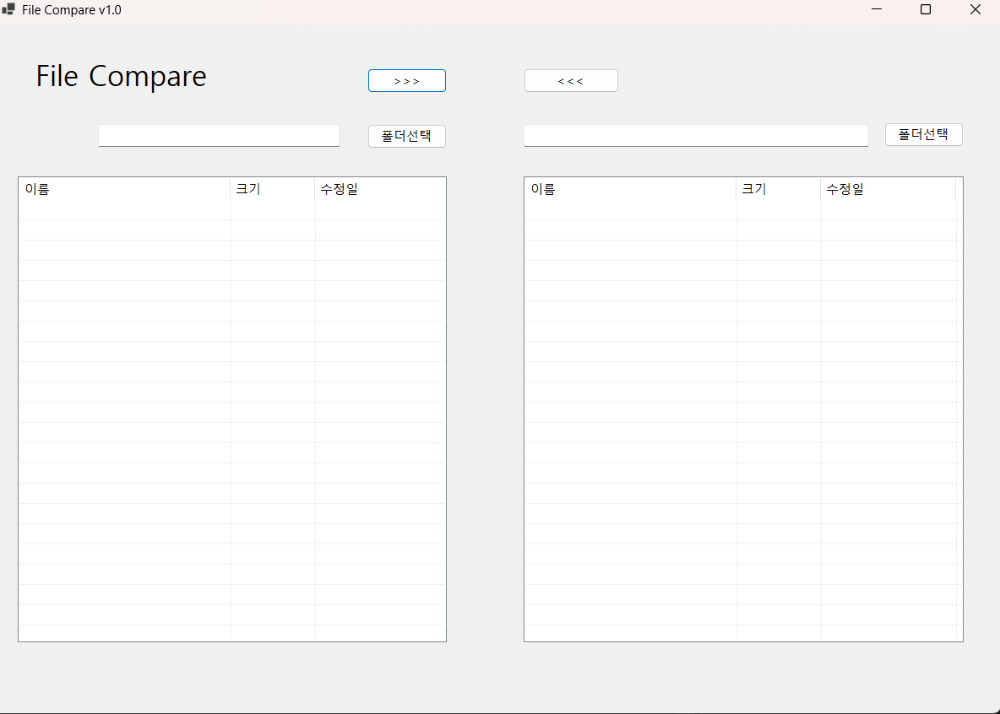
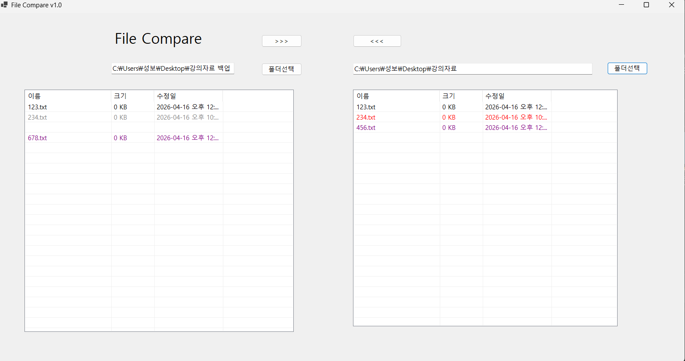

# (C# 코딩) 폴더안에 파일비교
## 개요-C# 프로그래밍학습
-1줄소개: 폴더안에 파일을 비교하는 프로그램
-사용한플랫폼:
   -C#, .NET Windows Forms, Visual Studio, GitHub
-사용한컨트롤:
   -Label, TextBox, ListView, Button, Panel, SplitContainer
-사용한기술과구현한기능:
   -Visual Studio를이용하여UI 디자인
   -SplitContainer로 두칸을 분할
## 실행화면(과제1)-코드의실행스크린샷과구현내용설명

-구현한내용(위그림참조)- 
  사용자가비교할폴더를선택할수있도록TextBox와Button을배치하였습니다.
  Button을클릭하면폴더선택대화상자가열리고, 사용자가폴더를선택하면TextBox에선택한폴더의경로가표시됩니다.
  ListView컨트롤을사용하여선택한폴더의파일목록을표시하도록구현하였습니다.
  ListView는파일이름, 크기, 수정날짜등의정보를열로나누어표시하며, 사용자가파일을비교하기쉽도록도와줍니다.
## 실행화면(과제2)-코드의실행스크린샷과구현내용설명

-구현한내용(위그림참조)-파일 이름에 색상 추가
## 실행화면(과제3)-코드의실행스크린샷과구현내용설명

-구현한내용(위그림참조)-OOOOO
## 실행화면(과제4)-코드의실행스크린샷과구현내용설명

-구현한내용(위그림참조)-OOOOO
